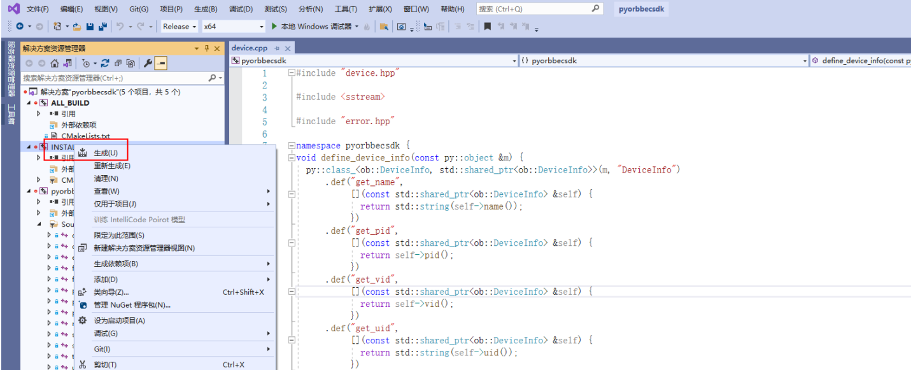
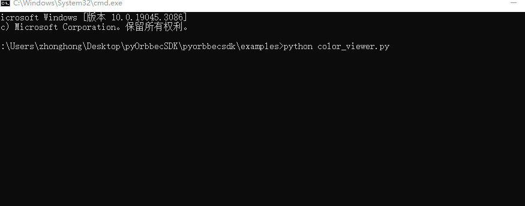

# 1. 概述

本文档主要介绍Orbbec SDK Python Wrapper的功能，Orbbec SDK Python Wrapper基于Orbbec
SDK进行设计封装，主要实现数据流接收，设备指令控制。

为了使用户正确的、高效的在自己的项目中快速接入Orbbec SDK Python
Wrapper SDK，防止在使用相关API的过程中由于不规范的调用而引起其他问题，故拟定本文档来规范API调用。

## 1.1  系统要求

* Windows：Windows 10 (x64)
* Linux: Ubuntu 16.04/18.04/20.04/22.04 (x64)
* Arm32: Ubuntu16.04/18.04/20.04/22.04
* Arm64: Ubuntu18.04/20.04/22.04

## 1.2 编译平台要求

* Windows：Visual Studio 2017 及以上
* Linux: gcc 5.4.0 及以上
* cmake: 3.15.0 及以上

## 1.3 Python 版本

* Python 3.6/3.7/3.8/3.9

## 1.4  Python SDK支持的硬件产品

| **产品列表**       | **固件版本**                             |
|----------------|--------------------------------------|
| Astra2         | 2.8.20                               |
| Gemini2 L      | 1.4.32                               |
| Gemini2        | 1.4.60                               |
| FemtoMega      | 1.1.5  (支持window10、ubuntu20.04及以上系统) |
| Astra+         | 1.0.22/1.0.21/1.0.20/1.0.19          |
| Femto          | 1.6.7                                |
| Femto W        | 1.1.8                                |
| Dabai          | 2436                                 |
| Dabai DCW      | 2460                                 |
| Dabai DW       | 2606                                 |
| Astra Mini     | 2418                                 |
| Astra Mini Pro | 1007                                 |
| Astra Pro Plus | 2513                                 |
| A1 Pro         | 3057                                 |
| Gemini E       | 3460                                 |
| Gemini E Lite  | 3606                                 |
| Gemini         | 3.0.18                               |
| Deeyea         | 3012/3015                            |

# 2. Orbbec SDK Python Wrapper Sample编译说明

## 2.1 Windows python sdk 编译

* 下载 python sdk 源码

```bash
git clone https://github.com/OrbbecDeveloper/pyorbbecsdk.git
```

* 安装依赖

```bash
pip3 install -r requirements.txt
```

这里假定你已经正确的安装了python3，如果没有安装python3，可以参考[python官网](https://www.python.org/downloads/)
选择你的python3版本进行安装。

* 打开Cmake，首先设置源码路径，“build”文件夹设置为生成二进制文件的路径，如下图所示。


* 点击“Configure”并选择对应的Visual Studio版本和平台版本后，点击“Finish”，如下所示：


这里假定你已经正确的安装了cmake， 如果没有安装cmake，可以参考[cmake官网](https://cmake.org/download/)

* 点击“Generate”，如下所示：


* 可以通过以下两种方式打开python SDK工程

方法一：通过cmake，点击“Open Project”按钮，打开Visual Studio工程


方法二：通过文件夹，build中的Visual Studio工程直接启动，如下图所示:


* 打开python SDK工程，如下图所示：
  

* 右键点击pyorbbecsdk 编译，如下图所示：
  

* 鼠标右键点击 INSTALL，如下图所示：
  
  编译好的文件会拷贝到 install/lib 目录下，如下图所示：
  

* 将install/lib 目录下的文件 拷贝到 examples目录下，如下图所示：


在examples 目录执行`python ColorViewer.py`等测试例子，如下图所示：


## 2.2 Linux python SDK 编译

### 下载 python sdk 源码

```bash
git clone https://github.com/OrbbecDeveloper/pyorbbecsdk.git
```

### 安装依赖

```bash
sudo apt-get install python3-dev pybind11-dev python3-venv python3-pip
```

### Python SDK 编译

```bash
mkdir build
cd build
cmake ..
make -j4
make install
```

### 测试 Sample

```bash
cd pyorbbecsdk
# set PYTHONPATH environment variable to include the lib directory in the install directory
export PYTHONPATH=$PYTHONPATH:$(pwd)/install/lib/
# Skip this if you don't want virtual environment
python3 -m venv  ./venv
source ./venv/bin/activate
# install dependencies
pip install -r requirements.txt
# run examples
python examples/depth_viewer.py
```

# 3. 常用调用流程

## 3.1 视频数据获取

首先我们需要创建一个Pipeline，通过Pipeline可以很容易的打开和关闭多种类型的流并获取一组帧数据。

```python
from pyorbbecsdk import *

config = Config()
pipeline = Pipeline()
```

获取Depth相机的所有流配置，找到对应分辨率、格式、帧率的profile

```python
profile_list = pipeline.get_stream_profile_list(OBSensorType.DEPTH_SENSOR)
depth_profile = profile_list.get_video_stream_profile(640, 0, OBFormat.Y16, 30)
```

通过创建Config 开启视频流，这里将启用Depth流

```python
config.enable_stream(depth_profile)
pipeline.start(config)
```

以阻塞的方式等待一帧数据，该帧是一个复合帧，里面包含配置里启用的所有流的帧数据，并设置帧的等待超时时间为100ms

```python
frames = pipeline.wait_for_frames(100)
depth_frame = frames.get_depth_frame()
```

停止Pipeline，将不再产生帧数据

```python
pipeline.stop()
```

## 3.2 常用接口API介绍

### 3.2.1 获取序列号

### 3.2.2 获取设备名称

### 3.2.3 获取相机参数

### 3.2.4 获取和设置红外相机的曝光值

### 3.2.5 彩色相机自动曝光

### 3.2.6 获取和设置彩色相机曝光值

### 3.2.7 获取和设置彩色相机增益

### 3.2.8 彩色相机数据流镜像

### 3.2.9 深度相机数据流镜像

### 3.2.10 红外相机数据流镜像

### 3.2.11 开关激光

### 3.2.12 开关LDP

### 3.2.13 开关软件滤波

## 4 FAQ
