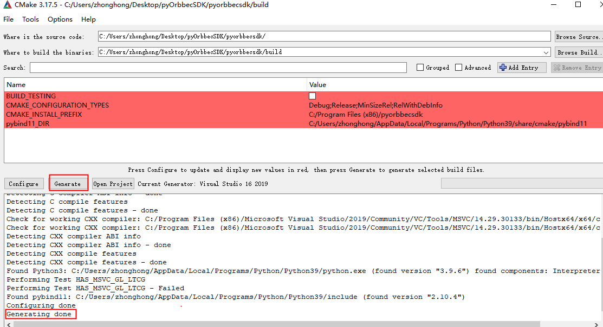
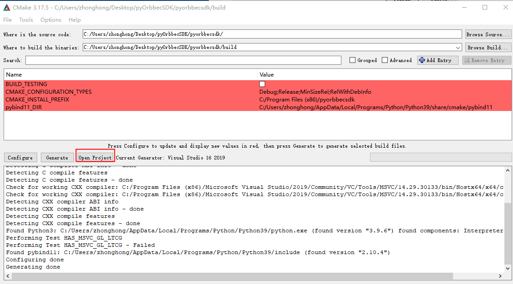
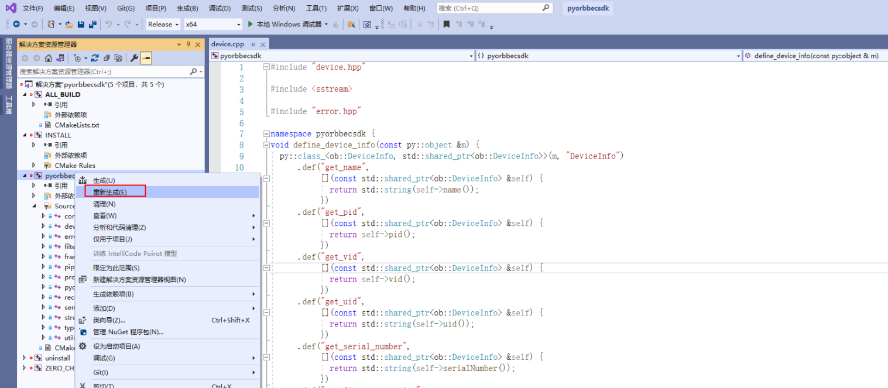

# 1. Overview

This document mainly introduces the functions of Orbbec SDK Python Wrapper, which is designed and encapsulated based on
Orbbec SDK, mainly achieving data stream reception and device command control.

## 1.1 System Requirements

* Windows: Windows 10 (x64)
* Linux: Ubuntu 16.04/18.04/20.04/22.04 (x64)
* Arm32: Ubuntu16.04/18.04/20.04/22.04
* Arm64: Ubuntu18.04/20.04/22.04

## 1.2 Compilation Platform Requirements

* Windows: Visual Studio 2017 and above
* Linux: gcc 5.4.0 and above
* cmake: 3.15.0 and above

## 1.3 Python Version

* Python 3.6/3.7/3.8/3.9

## 1.4 Hardware Products Supported by Python SDK

| **Product List** | **Firmware Version**                                  |
|------------------|-------------------------------------------------------|
| Astra2           | 2.8.20                                                |
| Gemini2 L        | 1.4.32                                                |
| Gemini2          | 1.4.60                                                |
| FemtoMega        | 1.1.5  (supports Windows 10, Ubuntu 20.04, and above) |
| Astra+           | 1.0.22/1.0.21/1.0.20/1.0.19                           |
| Femto            | 1.6.7                                                 |
| Femto W          | 1.1.8                                                 |
| Dabai            | 2436                                                  |
| Dabai DCW        | 2460                                                  |
| Dabai DW         | 2606                                                  |
| Astra Mini       | 2418                                                  |
| Astra Mini Pro   | 1007                                                  |
| Astra Pro Plus   | 2513                                                  |
| A1 Pro           | 3057                                                  |
| Gemini E         | 3460                                                  |
| Gemini E Lite    | 3606                                                  |
| Gemini           | 3.0.18                                                |
| Deeyea           | 3012/3015                                             |

# 2. Orbbec SDK Python Wrapper Sample Compilation Instructions

## 2.1 Windows Python SDK Compilation

* Download the Python SDK source code.

```bash
git clone https://github.com/OrbbecDeveloper/pyorbbecsdk.git
```

* Install dependencies.

```bash
pip3 install -r requirements.txt
```

Here, it is assumed that you have installed Python 3 correctly. If you have not installed Python 3, you can refer to
the [Python official website](https://www.python.org/downloads/) and choose your Python 3 version for installation.

* Open Cmake, set the source code path, and set the "build" folder as the path for generating binary files, as shown in
  the following figure.


* Click "Configure" and select the corresponding Visual Studio version and platform version. Then click "Finish", as
  shown below:


Here, it is assumed that you have installed Cmake correctly. If you have not installed Cmake, you can refer to
the [Cmake official website](https://cmake.org/download/) for installation.

* Click "Generate", as shown below:



* You can open the Python SDK project in two ways:

Method 1: Use Cmake, click the "Open Project" button, and open the Visual Studio project.



Method 2: Use the file explorer to directly start the Visual Studio project in the build directory, as shown in the
following figure:


* Open the Python SDK project, as shown below:
  

* Right-click "pyorbbecsdk" to compile, as shown below:
  

* Right-click "INSTALL", as shown below:
  
  The compiled files will be copied to the install/lib directory, as shown below:
  

* Copy the files in the install/lib directory to the examples directory, as shown below:


In the examples directory, execute test examples such as `python ColorViewer.py`, as shown below:


## 2.2 Linux Python SDK Compilation

### Download Python SDK source code

```bash
git clone https://github.com/OrbbecDeveloper/pyorbbecsdk.git
```

### Install dependencies

```bash
sudo apt-get install python3-dev python3-pip cmake
pip3 install -r requirements.txt
```

### Compile Python SDK

```bash
mkdir build && cd build
cmake ../
make
make install

```

### Test examples

```bash
cd ../examples/
python3 ColorViewer.py
```

# 3. Orbbec SDK Python Wrapper Function Introduction

## 3.1 Device Enumeration

Get the device list:

```python
from pyorbbec import PyOrbbec

pyorbbec = PyOrbbec()
device_list = pyorbbec.get_device_list()
```

## 3.2 Device Control

Open the device:

```python
from pyorbbec import PyOrbbec

pyorbbec = PyOrbbec()
device_list = pyorbbec.get_device_list()
if device_list:
    device = pyorbbec.open_device(device_list[0])
```

Close the device:

```python
pyorbbec.close_device(device)
```

## 3.3 Device Properties

Get device property value:

```python
value = pyorbbec.get_device_property(device, property_id)
```

Set device property value:

```python
pyorbbec.set_device_property(device, property_id, value)
```

## 3.4 Data Stream Reception

Get color stream:

```python
color_stream = pyorbbec.get_color_stream(device)
if color_stream is not None:
    while True:
        color_frame = color_stream.get_frame()
        if color_frame is not None:
            color_data = color_frame.data
            # do something
        else:
            break
```

Get depth stream:

```python
depth_stream = pyorbbec.get_depth_stream(device)
if depth_stream is not None:
    while True:
        depth_frame = depth_stream.get_frame()
        if depth_frame is not None:
            depth_data = depth_frame.data
            # do something
        else:
            break
```

Get infrared stream:

```python
infrared_stream = pyorbbec.get_infrared_stream(device)
if infrared_stream is not None:
    while True:
        infrared_frame = infrared_stream.get_frame()
        if infrared_frame is not None:
            infrared_data = infrared_frame.data
            # do something
        else:
            break
```

Get point cloud stream:

```python
point_cloud_stream = pyorbbec.get_point_cloud_stream(device)
if point_cloud_stream is not None:
    while True:
        point_cloud_frame = point_cloud_stream.get_frame()
        if point_cloud_frame is not None:
            point_cloud_data = point_cloud_frame.data
            # do something
        else:
            break
```

Get user mask stream:

```python
user_mask_stream = pyorbbec.get_user_mask_stream(device)
if user_mask_stream is not None:
    while True:
        user_mask_frame = user_mask_stream.get_frame()
        if user_mask_frame is not None:
            user_mask_data = user_mask_frame.data
            # do something
        else:
            break
```

## 3.5 Device Command Control

Send a command to the device:

```python
pyorbbec.send_command(device, command_id, data)
```

## 3.6 Depth Data Processing

Convert depth data to 3D point cloud:

```python
point_cloud = pyorbbec.convert_depth_to_point_cloud(depth_data, intrinsic)
```

Convert depth data to color data:

```python
color_data = pyorbbec.convert_depth_to_color(depth_data, color_stream, intrinsic)
```

Get depth data intrinsic parameters:

```python
intrinsic = pyorbbec.get_depth_intrinsic(device)
```

## 3.7 Color Data Processing

Convert color data to gray data:

```python
gray_data = pyorbbec.convert_color_to_gray(color_data)
```

Get color data intrinsic parameters:

```python
intrinsic = pyorbbec.get_color_intrinsic(device)
```
