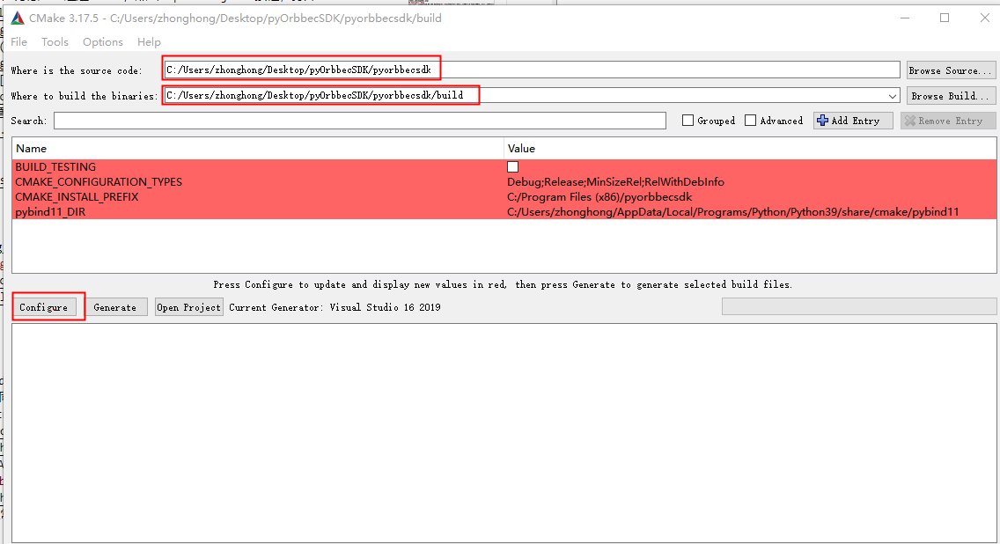
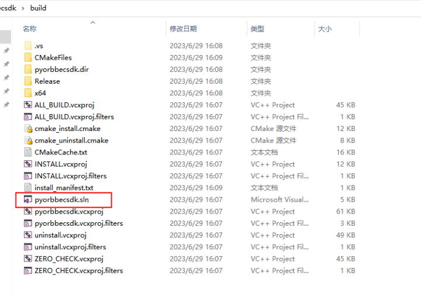

# Orbbec SDK Python Wrapper Documentation

## Contents
<!-- TOC -->
* [Orbbec SDK Python Wrapper Documentation](#orbbec-sdk-python-wrapper-documentation)
  * [Contents](#contents)
  * [Overview](#overview)
  * [System Requirements](#system-requirements)
    * [OS Requirements](#os-requirements)
    * [Compilation Platform Requirements](#compilation-platform-requirements)
    * [Python Version](#python-version)
    * [Hardware Products Supported by Python SDK](#hardware-products-supported-by-python-sdk)
  * [Orbbec SDK Python Wrapper Sample Compilation Instructions](#orbbec-sdk-python-wrapper-sample-compilation-instructions)
    * [Windows Python SDK Compilation](#windows-python-sdk-compilation)
      * [Download the Python SDK source code.](#download-the-python-sdk-source-code)
      * [Install dependencies.](#install-dependencies)
      * [Configure Visual Studio project.](#configure-visual-studio-project)
      * [Compile the Python SDK.](#compile-the-python-sdk)
      * [Test examples.](#test-examples)
  * [Linux Python SDK Compilation](#linux-python-sdk-compilation)
    * [Download Python SDK source code](#download-python-sdk-source-code)
    * [Install dependencies](#install-dependencies-1)
    * [Compile Python SDK](#compile-python-sdk)
    * [Test examples](#test-examples-1)
  * [Orbbec SDK Python Wrapper Function Introduction](#orbbec-sdk-python-wrapper-function-introduction)
    * [Video stream acquisition](#video-stream-acquisition)
    * [Introduction to common interface APIs](#introduction-to-common-interface-apis)
      * [Getting a list of devices](#getting-a-list-of-devices)
      * [Getting a list of sensors](#getting-a-list-of-sensors)
      * [Getting device information](#getting-device-information)
      * [Set color  auto-exposure](#set-color--auto-exposure)
      * [Getting and setting colour camera exposure values](#getting-and-setting-colour-camera-exposure-values)
      * [Getting and setting the colour camera gain](#getting-and-setting-the-colour-camera-gain)
      * [Mirroring the colour camera data stream](#mirroring-the-colour-camera-data-stream)
      * [Switching laser](#switching-laser)
      * [Switching LDP](#switching-ldp)
      * [Switch software filtering](#switch-software-filtering)
      * [Other interfaces](#other-interfaces)
  * [FAQ](#faq)
<!-- TOC -->
## Overview

This document mainly introduces the functions of Orbbec SDK Python Wrapper, which is designed and encapsulated based on
Orbbec SDK, mainly achieving data stream reception and device command control.

## System Requirements

### OS Requirements

* Windows: Windows 10 (x64)
* Linux: 18.04/20.04/22.04 (x64)
* Arm32: 18.04/20.04/22.04
* Arm64: Ubuntu18.04/20.04/22.04

### Compilation Platform Requirements

* Windows: Visual Studio 2017 and above
* Linux: gcc 5.4.0 and above
* cmake: 3.15.0 and above

### Python Version

* Python 3.6/3.7/3.8/3.9

### Hardware Products Supported by Python SDK

| **Product List** | **Firmware Version**                                  |
|------------------|-------------------------------------------------------|
| Astra2           | 2.8.20                                                |
| Gemini2 L        | 1.4.32                                                |
| Gemini2          | 1.4.60                                                |
| FemtoMega        | 1.1.5  (supports Windows 10, Ubuntu 20.04, and above) |
| Astra+           | 1.0.22/1.0.21/1.0.20/1.0.19                           |
| Femto            | 1.6.7                                                 |
| Femto W          | 1.1.8                                                 |
| Dabai            | 2436                                                  |
| Dabai DCW        | 2460                                                  |
| Dabai DW         | 2606                                                  |
| Astra Mini       | 2418                                                  |
| Astra Mini Pro   | 1007                                                  |
| Astra Pro Plus   | 2513                                                  |
| A1 Pro           | 3057                                                  |
| Gemini E         | 3460                                                  |
| Gemini E Lite    | 3606                                                  |
| Gemini           | 3.0.18                                                |
| Deeyea           | 3012/3015                                             |

## Orbbec SDK Python Wrapper Sample Compilation Instructions

### Windows Python SDK Compilation

#### Download the Python SDK source code

```bash
git clone https://github.com/OrbbecDeveloper/pyorbbecsdk.git
```

#### Install dependencies

```bash
pip3 install -r requirements.txt
```

Here, it is assumed that you have installed Python 3 correctly. If you have not installed Python 3, you can refer to
the [Python official website](https://www.python.org/downloads/) and choose your Python 3 version for installation.

#### Configure Visual Studio project

* Open Cmake, set the source code path, and set the "build" folder as the path for generating binary files, as shown in
  the following figure.



* Click "Configure" and select the corresponding Visual Studio version and platform version. Then click "Finish", as
  shown below:


Here, it is assumed that you have installed Cmake correctly. If you have not installed Cmake, you can refer to
the [Cmake official website](https://cmake.org/download/) for installation.

* Click "Generate", as shown below:


#### Compile the Python SDK

* You can open the Python SDK project in two ways:

Method 1: Use Cmake, click the "Open Project" button, and open the Visual Studio project.


Method 2: Use the file explorer to directly start the Visual Studio project in the build directory, as shown in the
following figure:



* Open the Python SDK project, as shown below:
  

* Right-click "pyorbbecsdk" to compile, as shown below:
  

* Right-click "INSTALL", as shown below:
  
  The compiled files will be copied to the install/lib directory, as shown below:
  

* Copy the files in the install/lib directory to the examples directory, as shown below:


#### Test examples

In the examples directory, execute test examples such as `python ColorViewer.py`, as shown below:


## Linux Python SDK Compilation

### Download Python SDK source code

```bash
git clone https://github.com/OrbbecDeveloper/pyorbbecsdk.git
```

### Install dependencies

```bash
sudo apt-get install python3-dev python3-venv python3-pip
```

### Build

```bash
cd pyorbbecsdk
# Strongly recommended create virtual environment.
python3 -m venv  ./venv
source venv/bin/activate # activate virtual environment
pip3 install -r requirements.txt
mkdir build
cd build
cmake -Dpybind11_DIR=`pybind11-config --cmakedir` ..
make -j4
make install
```

### Test examples

```bash
cd pyorbbecsdk
# set PYTHONPATH environment variable to include the lib directory in the install directory
export PYTHONPATH=$PYTHONPATH:$(pwd)/install/lib/
# install udev rules
sudo bash ./scripts/install_udev_rules.sh
sudo udevadm control --reload-rules && sudo udevadm trigger
# run examples
python3 examples/depth_viewer.py
```

## Orbbec SDK Python Wrapper Function Introduction

### Video stream acquisition

First we need to create a Pipeline, which makes it easy to open and close multiple types of streams and fetch a set of
frames.

```python
from pyorbbecsdk import *

config = Config()
pipeline = Pipeline()
```

Get all the stream configurations for the Depth camera, find the profile corresponding to the resolution, format and
frame rate

```python
profile_list = pipeline.get_stream_profile_list(OBSensorType.DEPTH_SENSOR)
depth_profile = profile_list.get_video_stream_profile(640, 0, OBFormat.Y16, 30)
```

Turn on video streaming by creating a Config, here the Depth stream will be enabled

```python
config.enable_stream(depth_profile)
pipeline.start(config)
```

Wait for a frame of data in a blocking fashion, which is a composite frame containing the frame data of all the streams
enabled in the configuration, and set the frame wait timeout to 100ms

```python
frames = pipeline.wait_for_frames(100)
depth_frame = frames.get_depth_frame()
```

Stopping Pipeline will no longer produce frame data

```python
pipeline.stop()
```

### Introduction to common interface APIs

#### Getting a list of devices

```python
from pyorbbecsdk import *

self.context = Context()
device_list = self.context.query_devices()

```

#### Getting a list of sensors

```python
from pyorbbecsdk import *

# ...
device = device_list[0]
sensor_list = device.get_sensor_list()
```

#### Getting device information

```python
from pyorbbecsdk import *

# ...
device_info = device.get_device_info()
device_name = device_info.get_name()
device_pid = device_info.get_pid()
serial_number = device_info.get_serial_number()
# ...
```

#### Set color  auto-exposure

```python
from pyorbbecsdk import *

# ...
auto_exposure = True
device.set_bool_property(OBPropertyID.OB_PROP_COLOR_AUTO_EXPOSURE_BOOL, auto_exposure)
```

#### Getting and setting colour camera exposure values

```python
from pyorbbecsdk import *

# ...
device.set_bool_property(OBPropertyID.OB_PROP_COLOR_AUTO_EXPOSURE_BOOL, False)
curr_color_exposure = device.get_int_property(OBPropertyID.OB_PROP_COLOR_EXPOSURE_INT)
color_exposure = curr_color_exposure + 1
device.set_int_property(OBPropertyID.OB_PROP_COLOR_EXPOSURE_INT, color_exposure)
# ...
```

#### Getting and setting the colour camera gain

```python
from pyorbbecsdk import *

# ...
device.set_bool_property(OBPropertyID.OB_PROP_COLOR_AUTO_EXPOSURE_BOOL, False)
curr_color_gain = device.get_int_property(OBPropertyID.OB_PROP_COLOR_GAIN_INT)
color_gain = curr_color_gain + 1
device.set_int_property(OBPropertyID.OB_PROP_COLOR_GAIN_INT, color_gain)
# ...
```

#### Mirroring the colour camera data stream

```python
from pyorbbecsdk import *

# ...
mirror = True
device.set_bool_property(OBPropertyID.OB_PROP_COLOR_MIRROR_BOOL, mirror)
# ...
```

#### Switching laser

```python
from pyorbbecsdk import *

# ...
laser = True
device.set_bool_property(OBPropertyID.OB_PROP_LASER_BOOL, laser)
# ...
```

#### Switching LDP

```python
from pyorbbecsdk import *

# ...
ldp = True
device.set_bool_property(OBPropertyID.OB_PROP_LDP_BOOL, ldp)
# ...
```

#### Switch software filtering

```python
from pyorbbecsdk import *

# ...
soft_filter = True
device.set_bool_property(OBPropertyID.OB_PROP_DEPTH_SOFT_FILTER_BOOL, soft_filter)
# ...
```

#### Other interfaces

Please refer to the examples in the `examples` directory of the source package and the test cases in the `tests`
directory

## FAQ

Q: Why do I get the following error when running `python3 examples/depth_viewer.py` on Jetson Nano?

```bash
illegal instruction (core dumped)
```

A: Check your OpenCV installation. If you encounter the same error when running

```python
import cv2
```

export OPENBLAS_CORETYPE=ARMV8 (or whatever the actual hardware is) before launching python should hopefully get around this. For example:

```bash
OPENBLAS_CORETYPE=ARMV8 python
```

If you would like to make this export permanent, you should open your .bashrc file by typing on the terminal:

```bash
nano ~/.bashrc
```

and add the following line at the end of the file:

```bash
export OPENBLAS_CORETYPE=ARMV8
```

Refer to [this post](https://stackoverflow.com/questions/65631801/illegal-instructioncore-dumped-error-on-jetson-nano) for more information on how to resolve the issue.
