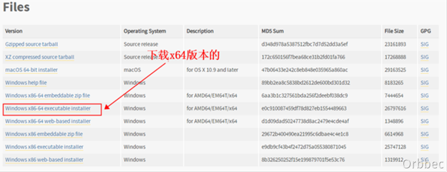
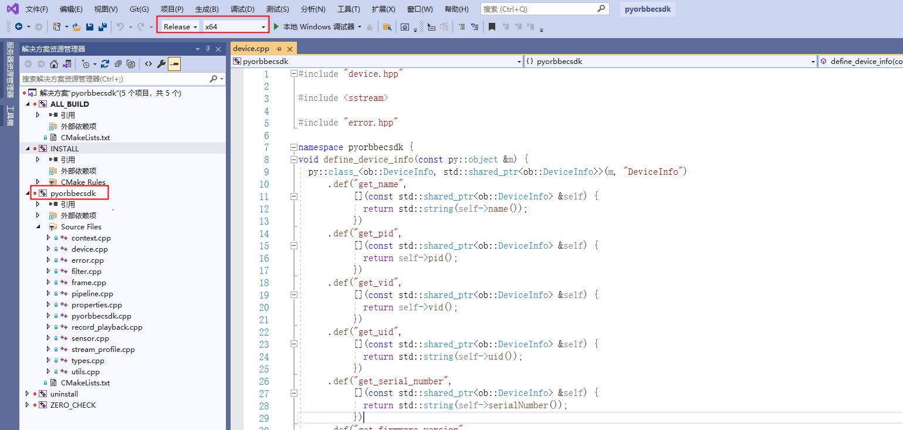

# 1. 概述
本文档主要介绍Orbbec SDK Python Wrapper的功能，Orbbec SDK Python Wrapper基于Orbbec SDK进行设计封装，主要实现数据流接收，设备指令控制。<br />为了使用户正确的、高效的在自己的项目中快速接入Orbbec SDK Python Wrapper SDK，防止在使用相关API的过程中由于不规范的调用而引起其他问题，故拟定本文档来规范API调用。<br />​
​

## 1.1  系统要求 
Windows：Windows 10 (x64)<br />Linux: Ubuntu 16.04/18.04/20.04/22.04 (x64)<br />Arm32: Ubuntu16.04/18.04/20.04/22.04​<br /> Arm64: Ubuntu18.04/20.04/22.04<br/>

## 1.2  Python SDK支持的硬件产品
| **产品列表** | **固件版本** |
|  --- | --- |
| Astra2         | 2.8.20                     |
| Gemini2 L      | 1.4.32                     |
| Gemini2        | 1.4.60                     |
| FemtoMega      | 1.1.5  (支持window10、ubuntu20.04及以上系统)                     |
| Astra+         | 1.0.22/1.0.21/1.0.20/1.0.19 |
| Femto          | 1.6.7                       |
| Femto W        | 1.1.8    				   |
| Dabai          | 2436                        |
| Dabai DCW      | 2460                        |
| Dabai DW       | 2606                        |
| Astra Mini     | 2418                        |
| Astra Mini Pro | 1007                        |
| Astra Pro Plus | 2513                        |
| A1 Pro         | 3057                        |
| Gemini E       | 3460                        |
| Gemini E Lite  | 3606              		   |
| Gemini         | 3.0.18                      |
| Deeyea         | 3012/3015                   |

# 2. Orbbec SDK Python Wrapper Sample编译说明
## 2.1 Windows python sdk 编译
1. 以python3.7为例，官网[https://www.python.org/downloads/release/python-377/](https://www.python.org/downloads/release/python-377/)下载3.7.7版本（其他python版本也可以）<br /><br />
2. 安装python3.7.7，再安装numpy、opencv-python和pybind11[global]

```
pip3 install numpy opencv-python pybind11[global]
```

另外，也可以指定服务器镜像来下载，如服务器镜像网站为[http://mirrors.aliyun.com/pypi/simple/](http://mirrors.aliyun.com/pypi/simple/)，指定其他服务器镜像网站也可以，目的是为了提高下载速度。
```
pip3 install numpy opencv-python pybind11[global] -i http://mirrors.aliyun.com/pypi/simple/ --trusted-host mirrors.aliyun.com
```

3. python sdk 编译
<br />​a) 下载 python sdk 源码
```bash
git clone https://github.com/OrbbecDeveloper/pyorbbecsdk.git
```
​b) 安装Visual Studio 2019、cmake 3.15及以上版本,cmake 的下载链接如下：
```
https://cmake.org/download/
```
c) 打开Cmake，首先设置源码路径，“build”文件夹设置为生成二进制文件的路径，如下图所示。<br /><br />

d) 点击“Configure”并选择对应的Visual Studio版本和平台版本后，点击“Finish”，如下所示：<br />

e)点击“Generate”，如下所示：<br /><br />

f)可以通过以下两种方式打开python SDK工程<br />
方法一：通过cmake，点击“Open Project”按钮，打开Visual Studio工程<br /><br />
方法二：通过文件夹，build中的Visual Studio工程直接启动，如下图所示。<br />

g) 打开python SDK工程，如下图所示： <br /><br />

h) 右键点击pyorbbecsdk 编译，如下图所示：<br /><br />

i) 鼠标右键点击 INSTALL，如下图所示：<br />
编译好的文件会拷贝到 install/lib 目录下，如下图所示：<br />

j) 将install/lib 目录下的文件 拷贝到 examples目录下，如下图所示：<br />


4. 在examples 目录执行python ColorViewer.py等测试例子，如下图所示：<br />


## 2.2 Linux python SDK 编译
### 下载 python sdk 源码
```bash
git clone https://github.com/OrbbecDeveloper/pyorbbecsdk.git
```

### 安装依赖
```bash
sudo apt-get install python3-dev pybind11-dev python3-venv python3-pip
```

### Python SDK 编译
```bash
mkdir build
cd build
cmake ..
make -j4
make install
```

### Sample 测试
```bash
cd pyorbbecsdk
# set PYTHONPATH environment variable to include the lib directory in the install directory
export PYTHONPATH=$PYTHONPATH:$(pwd)/install/lib/
# Skip this if you don't want virtual environment
python3 -m venv  ./venv
source ./venv/bin/activate
# install dependencies
pip install -r requirements.txt
# run examples
python examples/depth_viewer.py
```


# 3. 常用调用流程
## 3.1 视频数据获取
首先我们需要创建一个Pipeline，通过Pipeline可以很容易的打开和关闭多种类型的流并获取一组帧数据。<br />
```
config = Config()
pipeline = Pipeline()
```
获取Depth相机的所有流配置，找到对应分辨率、格式、帧率的profile
```
profile_list = pipeline.get_stream_profile_list(OBSensorType.DEPTH_SENSOR)
depth_profile = profile_list.get_video_stream_profile(640, 0, OBFormat.Y16, 30)
```

通过创建Config 开启视频流，这里将启用Depth流
```
config.enable_stream(depth_profile)
pipeline.start(config)
```

以阻塞的方式等待一帧数据，该帧是一个复合帧，里面包含配置里启用的所有流的帧数据，并设置帧的等待超时时间为100ms
```
frames = pipeline.wait_for_frames(100)
depth_frame = frames.get_depth_frame()
```

停止Pipeline，将不再产生帧数据
```
pipeline.stop()
```

## 3.2 常用接口API介绍
### 3.2.1 获取序列号

### 3.2.2 获取设备名称


### 3.2.3 获取相机参数


### 3.2.4 获取和设置红外相机的曝光值

### 3.2.5 彩色相机自动曝光


### 3.2.6 获取和设置彩色相机曝光值


### 3.2.7 获取和设置彩色相机增益


### 3.2.8 彩色相机数据流镜像


### 3.2.9 深度相机数据流镜像


### 3.2.10 红外相机数据流镜像


### 3.2.11 开关激光


### 3.2.12 开关LDP


### 3.2.13 开关软件滤波


## 4.10 FAQ
```

1. ImportError: libpython3.7m.so.1.0: cannot open shared object file: No such file or directory？
解决方法：
     sudo apt-get install libpython3.7


2. X Error
X Error: BadAccess (attempt to access private resource denied) 10
  Extension:    131 (MIT-SHM)
  Minor opcode: 1 (X_ShmAttach)
  Resource id:  0x12f
X Error: BadShmSeg (invalid shared segment parameter) 128
  Extension:    131 (MIT-SHM)
  Minor opcode: 5 (X_ShmCreatePixmap)
  Resource id:  0x2c0000d


解决方法： 按如下方法配置环境变量
1. sudo vi /etc/environment
2. QT_X11_NO_MITSHM=1
3. source /etc/environment

```